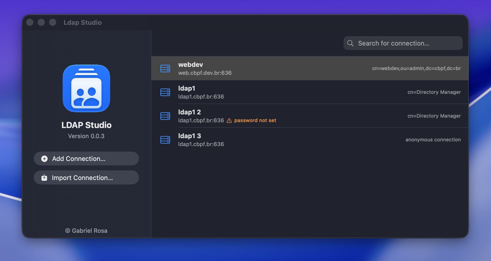
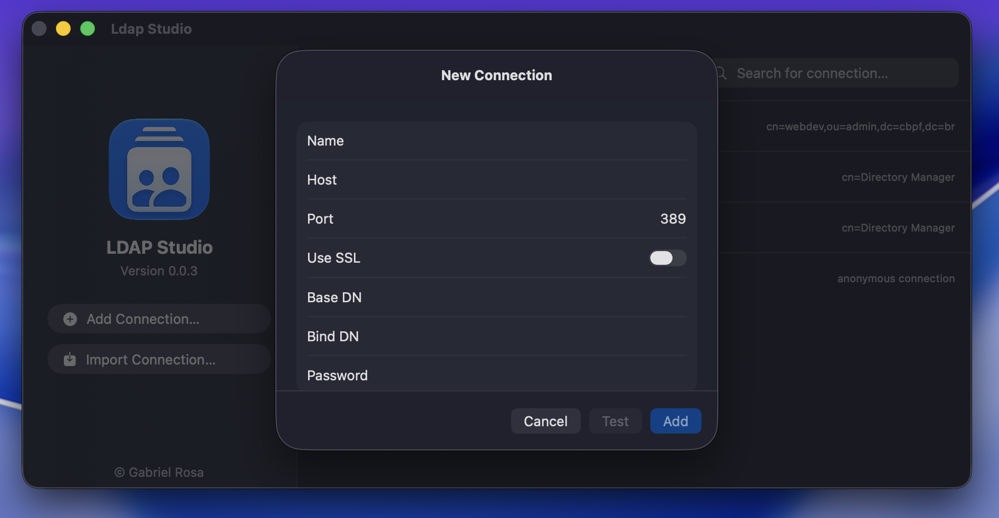
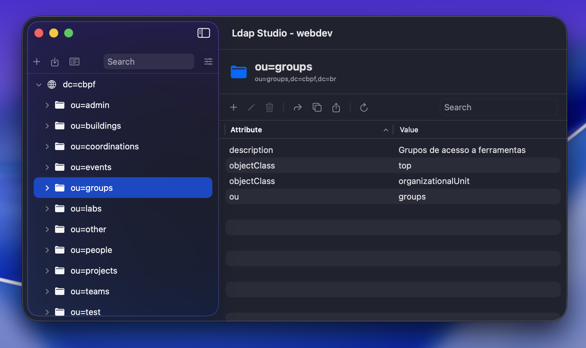

# Ldap Studio

🔍 A native macOS LDAP client, with a Rust-powered backend, for browsing, searching, and editing LDAP directories.

## Screenshots







## Why I Made This

I use LDAP at [CBPF](https://cbpf.br), the research center I work at. The only real LDAP client available was LDAP Admin for Windows, which hasn't been updated in a long time and is Windows-only — meaning I needed a Windows virtual machine running just to open it. So I built my own, native to macOS.

> ⚠️ I also wanted to learn Swift and Rust. I'm still learning both, so this app was built with the help of AI.

## Installation

1. Download the latest release from the [Releases page](https://github.com/dethdkn/ldap-studio/releases) — e.g. `ldap-studio-vx.x.x.zip`.
2. Extract the zip and move `ldap-studio.app` to your `/Applications` folder.
3. Since this app isn't signed with a paid Apple Developer account, macOS will say it's from an unidentified developer (or "not trusted") the first time you open it.
   - Go to **System Settings → Privacy & Security**, scroll to the bottom, and click **Open Anyway**.
   - If it still won't open, run this in Terminal:
     ```bash
     xattr -cr /Applications/ldap-studio.app
     ```

## Features

- Save, edit, and organize multiple LDAP connections
- Import/export connections as JSON (with an optional, obscured password) or from LDAP Admin's `.lcf` format
- Full directory tree browsing, with live filtering and real LDAP filter (RFC 4515) advanced search
- Add, edit, view, and delete attributes, including binary values
- View and set photos (`jpegPhoto`), auto-resized and center-cropped to 300×300
- Set passwords (`userPassword`) with client-side PBKDF2-SHA512 hashing — the plaintext is never stored or sent as-is
- Move, copy, create, and delete entries anywhere in the tree
- Import and export LDIF files
- Schema browser — object classes and attributes, with full superior-class inheritance resolved
- Autocomplete for attribute names and object classes when adding attributes or creating entries, driven by the server's own schema
- Native macOS menu bar integration for every major action

## Built With

- [SwiftUI](https://developer.apple.com/xcode/swiftui/) for the native macOS interface
- [Rust](https://www.rust-lang.org) for the LDAP backend, bridged to Swift via [uniffi](https://mozilla.github.io/uniffi-rs/)
- [ldap3](https://crates.io/crates/ldap3) for the LDAP protocol implementation
- [image](https://crates.io/crates/image) for photo processing, and RustCrypto's [pbkdf2](https://crates.io/crates/pbkdf2)/[sha2](https://crates.io/crates/sha2) for password hashing

## Requirements

- macOS 26 (Tahoe) or later
- Apple Silicon (arm64) — there's currently no Intel build

## License

[MIT](LICENSE)
